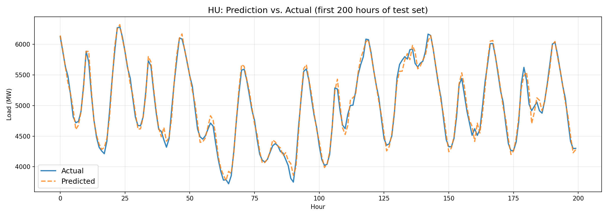

# ⚡️️Short-term Electricity Load Forecasting for European Countries

End-to-end time series forecasting project for hourly electricity consumption prediction. The model forecasts short-term load (24 hour ahead) for four European countries: Hungary, Germany, France, and Italy using LSTM neural networks.

---

## 📡 Technologies

| Technology | Purpose |
|---|---|
| **PySpark** | Large-scale data preprocessing and feature engineering |
| **Pandas / NumPy** | Data manipulation on filtered subsets |
| **TensorFlow / Keras** | LSTM model building and training |
| **Scikit-learn** | Normalization (MinMaxScaler), evaluation metrics |
| **Matplotlib** | Visualization (Prediction vs. Actual plots) |
| **Streamlit** | Interactive demo application |

## 📊 Example Output

After running `04_visualize.py`, timestamped plots are saved under `plots/`:

**Hungary (HU) — Prediction vs. Actual (first 200 hours of test set)**



The blue line shows actual electricity consumption (MW), the dashed line shows the LSTM's forecast. The model captures daily peaks and troughs closely.

---

## 🔢 Running

Run the project in the following order:

```
01_eda.ipynb  →  02_feature_engineering.ipynb  →  03_model.py  →  04_visualize.py  →  05_app.py
```

| Step | File | What it does |
|---|---|---|
| **1** | `notebooks/01_eda.ipynb` | Load raw data, clean, explore |
| **2** | `notebooks/02_feature_engineering.ipynb` | Build features, normalize, create sequences |
| **3** | `03_model.py` | Train LSTM per country, evaluate, save |
| **4** | `04_visualize.py` | Generate Prediction vs. Actual PNG plots |
| **5** | `05_app.py` | Launch interactive Streamlit app |

```bash
# Step 3
python 03_model.py

# Step 4
python 04_visualize.py

# Step 5
streamlit run 05_app.py
```

### 🐳 Running with Docker (Recommended)

To run the Streamlit app in a containerized environment:

1. **Build and start:**
   ```bash
   docker-compose up --build
   ```
2. **Access the app:** Open [http://localhost:8501](http://localhost:8501) in your browser.

*Note: The `models/` and `data/processed/` directories are mounted as volumes, so any updates made to models on your host machine are immediately reflected in the app.*

---

## ❗Requirements

Install dependencies:

```bash
pip install -r requirements.txt
``` 
## 📒 Dataset

- **Source:** [Europe Electricity Load (Hourly, 2019–2025) — Kaggle](https://www.kaggle.com)
- **Countries:** HU, DE, FR, IT (+ others available)
- **Granularity:** Hourly
- **Target variable:** `value` (electricity load in MW)
